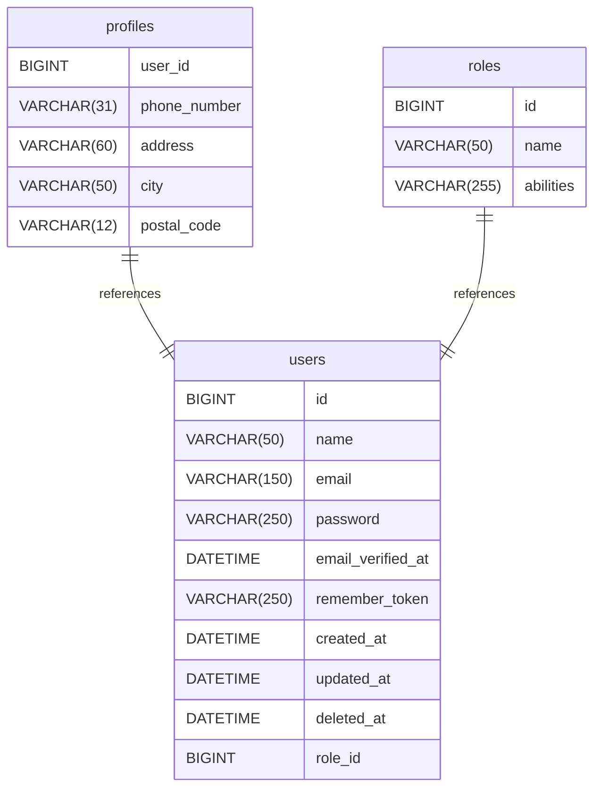

# osbus_v1 documentation

## Summary

- [Summary](#summary)
- [Introduction](#introduction)
- [Database type](#database-type)
- [Table structure](#table-structure)
	- [users](#users)
		- [Indexes](#indexes)
	- [profiles](#profiles)
		- [Indexes](#indexes-1)
	- [roles](#roles)
		- [Indexes](#indexes-2)
- [Relationships](#relationships)
- [Database Diagram](#database-diagram)

## Introduction

## Database type

-   **Database system:** MariaDB

## Table structure

### users

| Name                  | Type         | Settings                                | References | Note |
| --------------------- | ------------ | --------------------------------------- | ---------- | ---- |
| **id**                | BIGINT       | 🔑 PK, not null , unique, autoincrement |            |      |
| **name**              | VARCHAR(50)  | not null                                |            |      |
| **email**             | VARCHAR(150) | not null , unique                       |            |      |
| **password**          | VARCHAR(250) | not null                                |            |      |
| **email_verified_at** | DATETIME     | not null                                |            |      |
| **remember_token**    | VARCHAR(250) | not null                                |            |      |
| **created_at**        | DATETIME     | not null                                |            |      |
| **updated_at**        | DATETIME     | not null                                |            |      |
| **deleted_at**        | DATETIME     | not null                                |            |      |
| **role_id**           | BIGINT       | not null                                |            |      |

#### Indexes

| Name          | Unique | Fields |
| ------------- | ------ | ------ |
| users_index_0 |        | id     |
| users_index_1 |        | email  |

### profiles

| Name             | Type        | Settings                 | References          | Note |
| ---------------- | ----------- | ------------------------ | ------------------- | ---- |
| **user_id**      | BIGINT      | 🔑 PK, not null , unique | profiles_user_id_fk |      |
| **phone_number** | VARCHAR(31) | not null                 |                     |      |
| **address**      | VARCHAR(60) | not null                 |                     |      |
| **city**         | VARCHAR(50) | not null                 |                     |      |
| **postal_code**  | VARCHAR(12) | not null                 |                     |      |

#### Indexes

| Name             | Unique | Fields  |
| ---------------- | ------ | ------- |
| profiles_index_0 |        | user_id |

### roles

| Name          | Type         | Settings                                | References  | Note |
| ------------- | ------------ | --------------------------------------- | ----------- | ---- |
| **id**        | BIGINT       | 🔑 PK, not null , unique, autoincrement | roles_id_fk |      |
| **name**      | VARCHAR(50)  | not null , unique                       |             |      |
| **abilities** | VARCHAR(255) | not null                                |             |      |

#### Indexes

| Name            | Unique | Fields |
| --------------- | ------ | ------ |
| roles_2_index_0 |        | id     |
| roles_2_index_1 |        | name   |

## Relationships

-   **profiles to users**: one_to_one
-   **roles to users**: one_to_one

## Database Diagram

